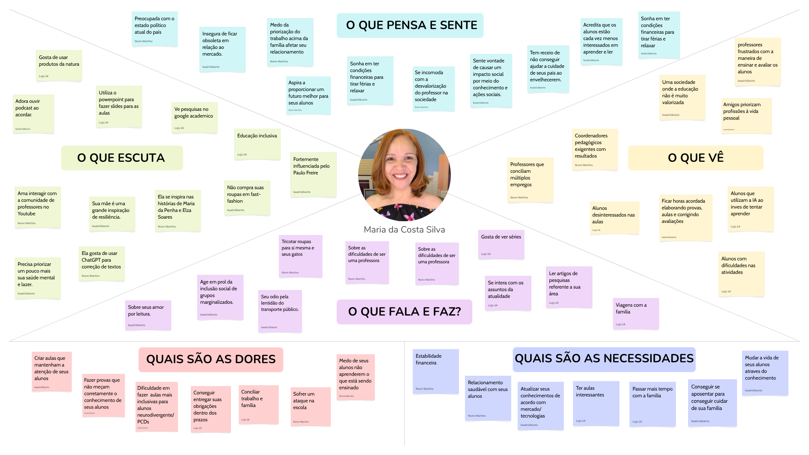

# Entrega 3 — Personas, mapa de empatia, contexto de uso e jornada

**Data:** 03/09/2026
**Status:** 🟩 concluída 
**Responsabilidade:** 1 persona por integrante; 1 mapa de empatia, 1 contexto de uso consolidado e 1 jornada por equipe (salvo orientação diferente do docente).

## Objetivo da atividade

Representar grupos de usuários de forma útil para decisões de design. Persona não é personagem decorativo: suas características devem alterar requisitos, prioridades, linguagem, fluxos ou critérios de avaliação.

## Atenção a projetos técnicos

Em TCCs sem interface original, a persona pode representar um **profissional que se apropria da contribuição técnica**: DBA, analista, cientista de dados, administrador, pesquisador, técnico, operador, gestor ou especialista de domínio.

Não escolha um perfil apenas porque “parece combinar” com a tecnologia. Explique **qual objetivo esse perfil teria e qual parte da contribuição do TCC produziria valor para ele**. Se ainda for hipótese, mantenha como hipótese/proto-persona a validar.

Também considere papéis diferentes quando houver tarefas distintas, por exemplo:

- operador que executa análises;
- administrador que configura e gerencia permissões;
- especialista que interpreta resultados;
- gestor que consulta relatórios e decide;
- auditor que revisa histórico.

## Entradas da Entrega 1

Antes de criar personas, retome os tipos de usuários, características relevantes, objetivos e hipóteses registradas na Entrega 1. A persona **não deve transformar uma hipótese inicial em fato por meio de uma história fictícia**.

| Item da Entrega 1 | Status inicial | Evidência disponível agora | Como será tratado nesta entrega |
|---|---|---|---|
| Docentes/elaboradores de provas como usuários diretos | F | A Entrega 1 identifica docentes/elaboradores de provas como os usuários que interagem diretamente com o produto. | Incorporar |
| Docente do Estado de São Paulo como perfil priorizado | F | O recorte do TCC utiliza dados do ENEM referentes ao Estado de São Paulo, e a Entrega 1 definiu esse perfil como prioritário para a interface. | Incorporar |
| Necessidade de conhecimento tecnológico para utilizar a ferramenta | H04 | A Entrega 1 registra essa característica como hipótese, sem evidência suficiente para afirmar o nível de conhecimento tecnológico do público. | Manter como hipótese e investigar |
| Uso da ferramenta durante a elaboração de avaliações | H04 | A Entrega 1 relaciona o uso à aplicação/elaboração de avaliações, mas não apresenta evidência sobre a frequência ou o momento exato de uso. | Manter como hipótese e investigar |
| Aprimorar as avaliações para que representem melhor o desempenho dos estudantes | H03 | Registrado como objetivo esperado na Entrega 1, mas ainda como hipótese quanto ao benefício efetivamente percebido pelo usuário. | Manter como hipótese e investigar |
| Docente precisa interpretar métricas sobre características estruturais das provas | F | A Entrega 1 identifica as métricas e características estruturais que precisam ser interpretadas para apoiar decisões sobre a avaliação. | Incorporar |
| Docente possui dificuldade para identificar possíveis efeitos das características estruturais da prova | F | Atualmente essa análise depende principalmente do conhecimento, experiência e repertório do próprio docente. | Incorporar |
| Alunos são afetados pelos resultados da ferramenta | H | A Entrega 1 identifica os alunos como stakeholders afetados, mas não como usuários diretos da interface. | Manter como hipótese e não representar como usuário da persona |
| Resultados da análise podem fornecer subsídios para docentes/elaboradores avaliarem características estruturais das provas e ajustarem sua dificuldade | H02 | A Entrega 1 apresenta essa possibilidade como uma contribuição do projeto, mas ainda não há evidência de que os usuários realmente utilizariam essas informações dessa forma. | Manter como hipótese e investigar |

## 1. Personas

### Persona P01 — Maria da Costa Silva

**Autor(a):** Luana Bortko Rodrigues **RA:** 24.123.006-9   
**Tipo:** primário 
**Base de evidências:** Proto-persona a validar 
**Hipóteses da Entrega 1 relacionadas:** H02, H03 e H04 

| Campo | Descrição |
|---|---|
| Faixa etária / contexto relevante | 46 anos, professora da educação básica, atuando no ensino médio de uma escola pública do estado de São Paulo. |
| Ocupação/papel | Professora de Literatura do ensino médio |
| Conhecimento do domínio | Possui conhecimento sobre práticas pedagógicas, avaliação e preparação de estudantes do ensino médio. Tem familiaridade com o contexto do ENEM e com as dificuldades apresentadas pelos alunos na interpretação e resolução de questões. |
| Experiência tecnológica | Possui experiência básica a intermediária com ferramentas digitais utilizadas no ambiente escolar, como computadores, plataformas educacionais e editores de documentos. Também tem experiência no uso de ferramentas de IA, para auxilio na correção de textos |
| Objetivos | Conseguir impactar a vida de seus estudantes, com aulas engajantes; Ter estabilidade financeira e profissional; Conseguir mais tempo com a família; Queria ter um maior impacto social por meio do conhecimento e ações sociais |
| Necessidades | Necessita manter seus conhecimentos atualizados, especialmente em relação a novas tecnologias, e contar com recursos que auxiliem no planejamento de aulas interessantes e relevantes. Também valoriza um bom relacionamento com os alunos e busca formas de contribuir para seu desenvolvimento por meio da educação. |
| Dores/frustrações | Sente dificuldade em criar aulas capazes de manter a atenção dos estudantes e em elaborar avaliações que representem adequadamente seus conhecimentos, tendo medo que seus alunos não consigam absorver corretamente o conteúdo dado em suas aulas. Também enfrenta desafios para tornar suas aulas mais inclusivas, além da pressão para cumprir suas obrigações dentro dos prazos. A rotina de trabalho pode dificultar a conciliação entre vida profissional e familiar. |
| Motivadores | Busca melhorar continuamente sua prática como professora e oferecer aulas mais interessantes e engajantes para seus alunos. Sente-se motivada por soluções que facilitem seu trabalho e permitam realizar suas atividades de forma mais eficiente, além de valorizar a inclusão social e a redução das desigualdades enfrentadas por grupos marginalizados. |
| Restrições/acessibilidade | Possui tempo limitado para análises devido à rotina de trabalho. Tem um conhecimento básico/intermediário de técnologia e pouco conhecimento de métricas de estátistica |
| Ambiente típico de uso | Escola pública, sala dos professores ou sala de aula, utilizando computador ou notebook. |
| Comportamentos relevantes | Costuma buscar informações que possam auxiliar no planejamento das aulas e na preparação dos alunos para avaliações. Prefere resultados objetivos e visualizações que permitam identificar rapidamente padrões e possíveis relações entre as características das questões e o desempenho. |

**Decisões de design influenciadas por P01:**

- A experiência tecnológica básica a intermediária e a falta de conhecimento estatístico avançado de P01 influenciaram a escolha por uma interface simples, objetiva e com resultados apresentados de forma visual. Sua rotina de trabalho e disponibilidade limitada de tempo também levaram à priorização de interações diretas e à redução de etapas desnecessárias.

### Persona P02 — João Paulo de Aquino Gonzaga

**Autor(a):** Beatriz Manaia Lourenço Berto **RA:** 22.125.060-8  
**Tipo:** primária  
**Base de evidências:** proto-persona a validar   
**Hipóteses da Entrega 1 relacionadas:** H02, H03 e H04  

| Campo | Descrição |
|---|---|
| Faixa etária / contexto relevante |João é um homem de 35 anos que teve amplo acesso a oportunidades educacionais ao longo de sua formação, incluindo ensino em escolas particulares e participação em diversos cursos de capacitação. Esse contexto contribuiu para sua formação acadêmica e para o desenvolvimento de uma relação próxima com os estudos e a tecnologia. |
| Ocupação/papel | Atua como professor de Ciência da Computação, lecionando para turmas do 5º, 6º e 7º semestres, nos períodos vespertino e noturno, em uma faculdade privada de São Paulo |
| Conhecimento do domínio | Possui alto conhecimento sobre educação e elaboração de avaliações, com experiência na criação, aplicação e acompanhamento do desempenho dos alunos em provas. Tem familiaridade com a análise de resultados e busca compreender as dificuldades apresentadas pelos estudantes, mas não necessariamente possui conhecimento aprofundado sobre métricas psicométricas específicas utilizadas na análise de avaliações. |
| Experiência tecnológica | **Alta.** Possui contato com tecnologia desde a adolescência, quando explorava computadores e equipamentos como rádios, televisõs e dispositivos de acesso à internet, buscando compreender seu funcionamento e solucionar problemas em casa. Atualmente, mantém-se atualizado em relação às novas tecnologias e demonstra grande facilidade para aprender e se adaptar a novas ferramentas e recursos tecnológicos.|
| Objetivos | Deseja transformar conteúdos complexos em aulas de fácil compreensão, atendendo tanto alunos com maior dificuldade quanto aqueles que apresentam maior facilidade de aprendizado. Busca ajudá-los a desenvolver confiança em seus conhecimentos e prepará-los para ingressar no mercado de trabalho. Valoriza a combinação entre conteúdos teóricos e atividades práticas em suas aulas. |
| Necessidades | Necessita manter-se constantemente atualizado sobre os avanços tecnológicos, tanto para acompanhar novas áreas quanto para aprimorar conhecimentos já adquiridos. Também busca receber feedbacks frequentes de alunos e outros docentes, utilizando essas percepções para aperfeiçoar continuamente suas aulas e práticas de ensino. Além disso, busca formas mais eficientes e precisas de avaliar e mensurar o nível de conhecimento e o desenvolvimento dos alunos, identificando suas dificuldades e oportunidades de melhoria.  |
| Dores/frustrações | Possui uma forte cobrança em relação ao próprio trabalho e enfrenta dificuldades para conciliar as demandas profissionais com momentos de descanso e lazer. Também se preocupa com a possibilidade de os alunos perderem o interesse pelo aprendizado e se tornarem excessivamente dependentes do uso de IA. Além disso, sente dificuldade em avaliar de maneira precisa e confiável o nível de conhecimento dos alunos, especialmente diante dessas mudanças na forma de aprendizagem. |
| Motivadores | Sua principal motivação é contribuir para a democratização do acesso à educação e utilizar a tecnologia como uma aliada do desenvolvimento humano e da construção de uma sociedade mais justa. Além de lecionar em uma faculdade privada, produz conteúdos didáticos gratuitos em suas redes sociais, buscando compartilhar conhecimento para além da sala de aula. Também se envolve com pesquisas relacionadas a cidades inteligentes, movido pelo interesse em explorar como a tecnologia pode ser aplicada para solucionar problemas da sociedade e melhorar a qualidade de vida das pessoas. |
| Restrições/acessibilidade | Não apresenta limitações, dificuldades ou condições que possam afetar sua utilização do sistema. Possui acesso a uma boa conexão de internet, alta familiaridade com tecnologias e facilidade para aprender e se adaptar a novas ferramentas e recursos digitais. |
| Ambiente típico de uso | Utiliza o sistema principalmente em casa, durante a preparação de atividades e avaliações, e na faculdade, especialmente em horários vagos. Acessa a plataforma principalmente por meio de seu notebook pessoal, sobretudo nas semanas que antecedem a aplicação das avaliações, para planejar e analisar as atividades. |
| Comportamentos relevantes | Costuma preparar suas avaliações com antecedência e revisar os conteúdos antes de aplicá-las. Após as avaliações, demonstra interesse em analisar o desempenho dos alunos e identificar suas principais dificuldades. Busca utilizar ferramentas tecnológicas que facilitem seu trabalho e explora novas soluções digitais para aprimorar suas práticas de ensino. Além disso, procura constantemente estratégias para tornar suas aulas mais dinâmicas e engajantes, buscando manter a atenção dos alunos e estimular seu interesse e disposição para aprender. |

**Decisões de design influenciadas por P02:**

- *Upload simplificado e orientado:* João prepara avaliações com antecedência e busca ferramentas que facilitem seu trabalho. Ele tem alta familiaridade tecnológica, mas valoriza eficiência e não quer perder tempo com configurações complexas.
- *Dashboard visual com métricas interpretáveis:* João sente dificuldade em avaliar precisamente o nível de conhecimento dos alunos e deseja identificar características da prova que possam impactar o desempenho. Ele precisa de informações claras e rápidas para tomar decisões.
- *Explicações integradas e acessíveis*: João valoriza o entendimento profundo e busca melhorar continuamente suas práticas. Ele precisa compreender o que cada métrica significa e como se relaciona com o desempenho, para ajustar suas provas de forma fundamentada.
- *Interface limpa:* João tem alta experiência tecnológica, mas enfrenta forte cobrança e dificuldade em conciliar demandas. Ele não quer perder tempo navegando em interfaces confusas. Além disso, ele valoriza a clareza para focar no que é essencial.

### Persona P03 — Vera Coelho 

**Autor(a):** Nuno Martins Guilhermino da Silva **RA:** 22.126.099-5   
**Tipo:** Primária  
**Base de evidências:** Observação   
**Hipóteses da Entrega 1 relacionadas:** H02, H03 e H04  

| Campo | Descrição |
|---|---|
| Faixa etária / contexto relevante | 32 anos. Professora de inglês em uma escola online de línguas|
| Ocupação/papel | É professora de inglês à distância, trabalhando em uma escolinha de línguas.  |
| Conhecimento do domínio | Possui conhecimento intermediário/avançado sobre ensino de língua inglesa e experiência prática na elaboração e aplicação de avaliações, mas não necessariamente possui conhecimento especializado em análise estatística de itens. |
| Experiência tecnológica | Utiliza computadores e plataformas digitais regularmente para ministrar aulas, preparar materiais e acompanhar alunos. Possui familiaridade com ferramentas como Microsoft Office e plataformas de ensino a distância, mas pode não estar familiarizada com ferramentas especializadas de análise de avaliações. |
| Objetivos | Seu maior objetivo como profissional é que seus alunos saiam de suas aulas se sentindo mais confiantes em suas habilidades e preparados para lidarem com usos da língua inglesa em situações reais de forma autônoma.|
| Necessidades | Com o seu trabalho, ela precisa acompanhar o progresso de seus alunos ao longo do andamento de sua tutela, e para isso ela precisa ter certeza que suas provas são apropriadas para o nível de cada turma/pessoa, e com sua rotina corrida, precisa de rápida certificação de que suas avaliações são formuladas com qualidade. |
| Dores/frustrações | Ela se sente frustrada quando a energia na qual lhe é dada em sala de aula não se traduz em um ambiente de avaliação. Tem dificuldade para determinar se o baixo desempenho dos alunos representa uma dificuldade real no conteúdo ou se é um resultado de um trabalho mal-feito, a deixando insegura sobre a sua qualidade como educadora e a segurança do seu emprego. |
| Motivadores | Seu maior motivador é poder ver em tempo real os resultados dos seus esforços transparecendo em seus alunos, além de ver-los engajando com suas aulas. Outro lado deste engajamento que a motiva é a qualidade resultar em manter o seu emprego. |
| Restrições/acessibilidade | Não apresenta necessidades específicas de acessibilidade identificadas. Possui boa conexão com a internet e letramento digital suficiente para utilizar plataformas educacionais.| 
| Ambiente típico de uso | Ela faz todas as suas atividades de docência, incluindo planejamento e formulação de atividades do seu escritório em sua casa, utilizando o seu computador pessoal. |
| Comportamentos relevantes | Costuma elaborar e revisar avaliações entre outras atividades profissionais, buscando reutilizar ou adaptar questões de avaliações anteriores. Consulta materiais e ferramentas digitais para preparar suas aulas e avaliações. Após uma prova, acompanha o desempenho individual dos alunos para identificar conteúdos que precisam ser reforçados.  |

**Decisões de design influenciadas por P03:**

Como ela possui conhecimento limitado sobre métricas de avaliação, as métricas devem ser apresentadas de forma clara, contextualizada e acompanhadas de explicações que facilitem sua interpretação. Isso reduz a necessidade de conhecimento estatístico prévio e permite que a professora utilize os resultados para avaliar a qualidade das questões e o desempenho dos alunos.

### Síntese das personas

Explique diferenças entre os perfis e qual persona é prioritária. Evite personas duplicadas que só mudam nome/foto.

## 2. Mapa de empatia — equipe

**Persona escolhida:** P01 

**Justificativa:** A persona da professora que da aula em uma escola foi escolhida como principal por estar mais alinhada ao público-alvo do TCC. Como o projeto investiga a relação entre o formato das questões do ENEM e o desempenho dos estudantes, esse perfil possui contato mais direto com alunos que se preparam para esse exame e pode utilizar os resultados da ferramenta como apoio em sua prática pedagógica. As demais personas também são relevantes, mas possuem uma relação menos direta com o contexto central do projeto.

Documente também em texto: o que vê; ouve; diz/faz; pensa/sente; dores; ganhos. Diferencie **evidência** de **hipótese**.
 
**O que vê**
[H] Maria observa um ambiente educacional marcado por diferentes desafios. Percebe professores que precisam conciliar múltiplos empregos e coordenadores pedagógicos cada vez mais exigentes em relação aos resultados. Também observa a desvalorização da profissão docente e colegas frustrados com as formas tradicionais de ensinar e avaliar. Em seu cotidiano, presencia alunos desinteressados pelas aulas, com dificuldades para realizar atividades e, em alguns casos, utilizando ferramentas de inteligência artificial em substituição ao processo de aprendizagem. Além disso, percebe pessoas próximas priorizando o trabalho em detrimento da vida pessoal, o que reforça sua preocupação com o equilíbrio entre carreira e família.

**Ouve**
[H]Maria mantém contato frequente com conteúdos e pessoas relacionados à educação. Acompanha pesquisas acadêmicas e conteúdos sobre educação inclusiva, além de interagir com uma comunidade de professores no YouTube. É influenciada por ideias de Paulo Freire e por histórias de mulheres que considera inspiradoras, como Maria da Penha e Elza Soares, além de reconhecer sua mãe como uma referência de resiliência. No cotidiano, também utiliza ferramentas digitais, como PowerPoint para preparar aulas e ChatGPT para auxiliar na correção de textos, e gosta de ouvir podcasts. Busca ainda informações sobre atualidades e temas relacionados à sua área de atuação.

**Diz/Faz**
[H]Maria demonstra orgulho de seu trabalho e costuma falar sobre seu amor pela leitura e sobre as dificuldades enfrentadas na profissão docente. Busca manter-se informada sobre assuntos da atualidade e lê artigos e pesquisas relacionados à sua área. Procura agir em prol da inclusão social e demonstra preocupação com grupos marginalizados. Em seu tempo livre, gosta de assistir a séries, viajar com a família e tricotar roupas para si mesma e para suas gatas. Também utiliza ferramentas tecnológicas para auxiliar em atividades profissionais e busca incorporar novos recursos à sua rotina.

**Dores**
[H]Entre suas principais dificuldades estão a criação de aulas capazes de manter a atenção dos alunos e a elaboração de avaliações que representem adequadamente seus conhecimentos. Também enfrenta desafios para tornar suas aulas mais inclusivas. A necessidade de cumprir prazos e lidar com uma rotina extensa de preparação de aulas, elaboração e correção de avaliações contribui para sua sobrecarga. Além disso, preocupa-se com a segurança no ambiente escolar, com a conciliação entre trabalho e família e com a possibilidade de seus alunos não aprenderem adequadamente o conteúdo trabalhado.

**Ganhos**
[H]Maria busca melhorar continuamente sua prática profissional, oferecendo aulas mais interessantes, inclusivas e relevantes. Deseja ter ferramentas que facilitem seu trabalho e permitam compreender melhor as dificuldades e o desempenho de seus alunos. Também valoriza a possibilidade de manter seus conhecimentos atualizados e utilizar novas tecnologias de maneira produtiva. No âmbito pessoal, busca estabilidade financeira, maior equilíbrio entre vida profissional e familiar e, futuramente, condições para se aposentar e dedicar mais tempo à família e ao lazer.

## 3. Contexto de uso — consolidação

| Dimensão | Descrição | Implicação de design |
|---|---|---|
| Usuários | O sistema será utilizado principalmente por docentes e elaboradores de provas interessados em analisar características estruturais de avaliações antes de sua aplicação. Os perfis podem apresentar diferentes níveis de conhecimento tecnológico e estatístico. | A interface deve ser acessível a usuários com diferentes níveis de conhecimento, utilizando linguagem clara e apresentando as métricas de forma objetiva e interpretável. |
| Tarefas | O usuário realiza o upload da prova em PDF, insere os dados necessários para a análise, visualiza as métricas obtidas e consulta o detalhamento dos cálculos e resultados para identificar possíveis características da prova que possivelmente mais influenciamque o desempenho. | As tarefas devem seguir um fluxo simples e direto, com poucas etapas e orientações claras. As métricas devem ser apresentadas de forma visual, acompanhadas de explicações e detalhamentos quando necessário. |
| Equipamentos | O acesso ocorre principalmente por computador ou notebook, especialmente por meio do dispositivo utilizado pelo docente em suas atividades profissionais. | Priorizar uma interface web adequada para telas de computador e notebook, garantindo boa organização das informações e legibilidade dos gráficos, indicadores e tabelas. |
| Ambiente físico | O sistema pode ser utilizado em casa, durante a preparação de atividades e avaliações, ou na instituição de ensino, especialmente em horários disponíveis entre as atividades ou aulas dos docentes. | O sistema deve permitir uma utilização autônoma e eficiente, sem depender de condições específicas do ambiente. As principais informações devem ser facilmente identificadas para reduzir o tempo necessário para realizar as tarefas. |
| Ambiente social/organizacional | O uso ocorre no contexto de trabalho, principalmente durante o planejamento e preparação de avaliações. Os resultados podem servir como apoio à tomada de decisões sobre a estrutura das provas. | A interface deve apresentar os resultados de maneira organizada, facilitando sua consulta e interpretação pelo docente. |
| Papéis/permissões/governança | O docente atua como usuário responsável pelo envio das provas e pela consulta e interpretação dos resultados gerados pelo sistema. Não há necessidade de diferentes níveis de permissão para a realização da análise. | Manter o fluxo de acesso e utilização simples, evitando a inclusão de mecanismos administrativos ou níveis de permissão que não sejam necessários ao escopo atual. |
| Volume de dados/histórico | A análise é realizada a partir de provas em PDF e dos dados necessários para sua análise. O sistema pode lidar com diversas questões e métricas referentes a uma mesma avaliação, com base nos estudos do TCC sobre o ENEM, mas o histórico de múltiplas avaliações não é o foco | Organizar os resultados da análise e utilizar recursos como tabelas, gráficos, indicadores e tooltips/popup para o detalhamento, evitando sobrecarregar a interface |

## 4. Jornada do usuário — equipe

**Persona:** P01
**Objetivo da jornada:** Avaliar o possível impacto do formato da prova no desempenho dos alunos, identificando oportunidades de melhoria em sua estrutura antes de sua aplicação.
**Início e fim da jornada:** 
*Início da jornada:* Maria acabou de elaborar uma prova de múltipla escolha para sua turma. Antes de aplicá-la, ela revisa as questões e percebe que não tem certeza se aspectos estruturais da avaliação (como extensão dos enunciados, presença de imagens, ordem das questões e linguagem utilizada) podem influenciar o desempenho dos alunos. Como busca elaborar avaliações mais justas e já tem interesse em utilizar tecnologias para aprimorar sua prática, ela decide utilizar a plataforma como uma segunda opinião baseada em dados do ENEM.

*Fim da jornada:* Após analisar os resultados fornecidos pela plataforma, Maria identifica possíveis características da prova que podem estar associadas ao desempenho dos alunos. Ela utiliza essas informações, em conjunto com sua experiência pedagógica, para decidir se deve reformular determinadas questões antes da aplicação. A experiência pode levá-la a retornar à plataforma futuramente para analisar novas provas ou versões revisadas, buscando aprimorar continuamente suas avaliações.
 

| Etapa | Situação/ação | Objetivo | Pensamento/emoção | Dor | Oportunidade de design | Evidência |
|---|---|---|---|---|---|---|
| 1 O que motiva a usar a interface | Maria finaliza uma prova de múltipla escolha e decide analisá-la antes de aplicá-la aos alunos| Verificar se características estruturais da prova podem interferir no desempenho e obter uma segunda opinião sobre sua avaliação, para auxiliar na avaliação justa dos usuários e melhorar suas aulas. | “Será que meus alunos terão dificuldade por causa da forma como a prova foi elaborada, e não pelo conteúdo?” Sente insegurança e busca maior confiança. | Não possui uma forma rápida e baseada em dados para identificar possíveis problemas estruturais na prova. A revisão manual depende principalmente de sua própria experiência. | Deixar clara a proposta da ferramenta, seus benefícios e limitações; comunicar que a análise é indicativa e baseada em correlações do ENEM, funcionando como complemento à avaliação pedagógica. | Persona: professora que busca aprimorar suas práticas e utilizar tecnologias para melhorar suas avaliações. |
| 2 o que acontece durante sua interação com o produto | Maria acessa a plataforma, envia o PDF da prova e analisa as métricas e informações apresentadas. | Compreender os resultados da análise e identificar possíveis pontos de atenção na prova para fazer uma prova que avalie apenas os conhecimentos teóricos dos alunos. | “Agora consigo enxergar aspectos da prova que talvez não tivesse percebido sozinha e que podem me ajudar a fazer uma prova onde o formato poderá impactar minimamente o desempenho” Curiosidade e interesse, mas pode ter dúvidas sobre como as métricas foram calculadas.} | Pode não compreender o significado das métricas, ter dúvidas sobre os resultados ou encontrar dificuldades no upload e na interpretação das informações. | Oferecer upload simples, instruções claras, feedback de processamento e detalhamento das métricas por meio de tooltips ou informações explicativas. | Requisitos e funcionalidades definidas para o MVP; necessidade de detalhamento das métricas para apoiar sua interpretação. |
| 3 o que acontece depois que ele sai da interface | Maria utiliza os resultados da análise para revisar e, se necessário, ajustar a prova antes de aplicá-la. Após a aplicação, utiliza o desempenho dos alunos para identificar quais conteúdos foram compreendidos ou precisam ser mais trabalhados em suas aulas. | Elaborar avaliações que meçam de forma mais adequada o conhecimento dos alunos, permitindo identificar suas dificuldades e compreender quais conteúdos precisam ser reforçados em aula. | “Quero ter certeza de que o resultado da prova representa o que meus alunos realmente aprenderam, para saber como ajudá-los a avançar.” | Uma avaliação influenciada por características estruturais pode dificultar a interpretação do desempenho dos alunos e fazer com que Maria tenha uma percepção equivocada sobre o que eles realmente aprenderam. | Apresentar as métricas de forma clara e interpretável, permitindo que Maria compreenda os possíveis fatores estruturais da prova que podem interferir em sua avaliação e utilize essas informações como apoio à sua decisão pedagógica. | Persona e hipótese da jornada: a professora utiliza avaliações para acompanhar a aprendizagem dos alunos e orientar o planejamento das aulas. |
 
> A jornada pode incluir etapas **antes, durante e depois** do uso do produto. Não transforme a jornada em lista de telas.

## Síntese

Quais necessidades e objetivos devem obrigatoriamente aparecer nos cenários e nas tarefas seguintes?

Os cenários e as tarefas devem contemplar o objetivo dos professores de realizar avaliações mais justas e que representem adequadamente o conhecimento dos estudantes. Para isso, a ferramenta deve permitir que o professor analise as características do formato de suas provas e identifique possíveis aspectos que possam estar influenciando a avaliação do desempenho dos alunos. A análise das métricas, portanto, deve funcionar como um meio para que o professor reflita sobre a construção de suas avaliações e possa tomar decisões mais conscientes sobre sua elaboração.
A interface deve ser simples, objetiva e acessível a usuários com diferentes níveis de experiência tecnológica e conhecimento estatístico. As métricas disponibilizadas devem possuir descrições e explicações claras, permitindo que os professores compreendam o que cada medida representa e interpretem os resultados sem a necessidade de conhecimentos técnicos avançados.

## Checklist

- [X] Existe pelo menos uma persona por integrante.
- [X] As personas não são apenas diferenças demográficas superficiais.
- [x] Está claro o que é dado real e o que é hipótese/proto-persona.
- [x] A persona não “validou por ficção” uma hipótese da Entrega 1; afirmações continuam marcadas como hipótese quando não há evidência.
- [x] Objetivos e dores têm consequência para o design.
- [x] Contexto de uso está coerente com a Entrega 1.
- [ ] Em TCC sem interface original, a persona possui relação explícita com a contribuição técnica.
- [x] Papéis administrativos, técnicos e decisórios só foram criados quando possuem objetivos/tarefas diferentes.
- [x] Jornada possui etapas, dores e oportunidades e não é apenas wireflow.
- [x] IDs das personas foram adicionados à rastreabilidade.
