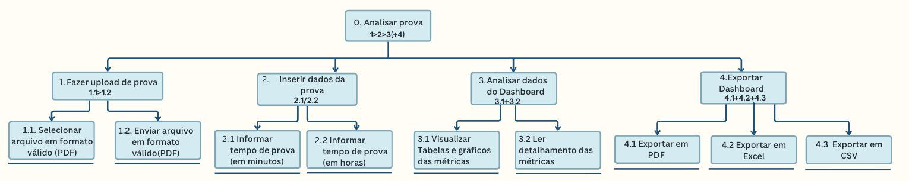

# Entrega 5 — Análise de tarefas: HTA, GOMS e CTT

**Data:** 13/09/2026 
**Status:** 🟨 Em andamento 
**Responsabilidade:** cada integrante modela pelo menos 1 HTA, 1 GOMS e 1 CTT. As três técnicas podem abordar a mesma funcionalidade ou funcionalidades distintas, conforme a orientação da disciplina.

## Objetivo da atividade

Modelar tarefas importantes sob perspectivas complementares: decomposição hierárquica (HTA), estrutura de metas/métodos/operações (GOMS) e relações temporais entre tarefas (CTT). O diagrama deve ser acompanhado de interpretação textual.

## Para projetos cujo TCC não previa interface

Modele **tarefas humanas relacionadas ao uso da contribuição técnica**, e não a implementação interna do algoritmo. Exemplos de boas tarefas para análise:

- investigar uma consulta de baixo desempenho;
- configurar uma análise e selecionar parâmetros;
- submeter um dataset e verificar sua validade;
- acompanhar uma execução demorada;
- comparar dois resultados/modelos;
- interpretar uma recomendação e decidir se a aceita;
- localizar uma execução anterior usando busca/filtros;
- gerar e compartilhar um relatório;
- administrar papéis/permissões quando isso for parte do trabalho real;
- revisar um alerta e registrar uma decisão.

Um CRUD pode gerar tarefas relevantes, mas “cadastrar usuário” só merece modelagem se tiver significado no domínio (papéis, validações, riscos, permissões, dependências).

## Seleção das tarefas

| ID | Tarefa | Persona/cenário de origem | Frequência/criticidade | Autor responsável |
|---|---|---|---|---|
| T01 | Analisar a prova | P1/P2/P3 e C02 | Alta - várias vezes por semestre, sempre que tiver alguma prova a ser aplicada | Beatriz |
| T02 | Analisar histórico de provas | P1/P2/P3 e C01 | Média - No começo ou finais de semestre | Luana |
| T03 | Gerar novas questões baseadas em provas já elaboradas | P1/P2/P3 e C03 | Média - XXXXX | Nuno |

<!--TAREFAS COMPLEXAS A PONTO DE SEREM MODELADAS

quando for definir obj da entrega 5;
-tem q combinar com grupo os objetivos q maparemos a tarefa:tem q ter a tarefa
ex:

1-obj analisa a prova(o padrao) cenario problema bia

2-obj analsia historico de provas (ja analisadas, dashboard de td prova ja analisda, tem comeco meio e fim, é objetivo cenario problema lu

3-tem conj de prova, uso p faze analise estatisitica e historica de periodo, dado perido faze analise estatisitcia e peço p ia produzir mais x questoes objetivo cenario problema nuno

outra opcao:
-comparar analises de provas (analisa dashboard de td rova q ele analisou,
-relatorios personalizados (?) 
-avaliar escrita???

-usa tabela do 1, parte de filtro e tal  p ajuda se quiser

tarefa n eh upload analise e analisa resultado eh PASSO de 1 tarefa, ta errado, como sei se eh passo ou tarefa?

obj tarefa msm pega do d cenario problema
identifica obj é consdierar ex usuario acoreda, obj faze upload ve se faz sentdio a pessoa acorda vou usa e faze yploiad

ver se obj final de us sistema eh faze upload, as tarefas sao os objetivos 
tcc todo, o sistema q previmos eh o obj de 1 pessoa so

NA MODELAGEM DE HTA GOMS E CTT TEM Q USA TODOS OS RECURSOS DA TECNICA

<!-- TAREFAS:ANALISAR PROVA

esses passos sao de 1 objetivo: analisar prova

1-upload de arquivo contendo prova
  -maneiras de fazer upload?
  -formatos aceitos?
  -padrões que prova precisa ter para ser analisada?
  -...

2-inserção de dados da prova de maneira manual
  -tem difernetes maneiras de ser inserida?
  -...

3-análise do dashboard com métricas da prova
  -maneiras de analisar dashboard?

4-download do dashboard
  -em que formatos?
  -quantas maneiras de fazer download?
-->

> Priorize tarefas necessárias para que o usuário alcance objetivos centrais. Não desperdice a modelagem em ações triviais isoladas, como “clicar em login”, se o objetivo relevante é maior. Da mesma forma, não modele o funcionamento interno do algoritmo como se fosse uma tarefa humana.

---

<!--
tarefas tem q ter complexidade:

DECIDIR 3 OBJETIVOS MAIS IMPORTANTES DO PROJETO
-isso tem haver com duvida q tirmos ontem cm plinio?
-ja q tem 4 tarefas a gnt escolhe 1 objetivo p duplica ent?

ex goms 2 metodos
tem q expandir msm q n seja oq faremoas d vdd , usa emtodo em sua completudw

goms
go
g1 
op
op
op

g2
metodo 1 
regra selecao 
 op 
 op

  g3
  metodo sleecao 2
  op
  op

metodo de selecao sao 2 maneiras de faze msm coisa 
 se no projeto n precisa
 pode traze cois nova q nnc apareceu no texto p treina o metodo
-->

## HTA — T01 Analisar a prova

**Autor(a):** Beatriz Manaia Lourenço Berto — 22.125.060-8
contexto mais comum eh o da bia no passado la 

### Descrição da tarefa

<!--{{objetivo, ponto de início, conclusão esperada, contexto}}-->

- Objetivo: Permitir que o docente envie uma prova em um dos formatos aceitos pelo sistema para que suas características estruturais sejam extraídas e analisadas, possibilitando a visualização de métricas que apoiem a tomada de decisão sobre possíveis ajustes na avaliação.

- Ponto de início: O docente possui uma prova pronta para análise, salva no dispositivo que será utilizado para acessar o sistema, em um dos formatos suportados.

- Conclusão esperada: A prova foi carregada com sucesso no sistema e as métricas referentes às suas características estruturais estão disponíveis para consulta e análise.

- Contexto: Cerca de duas semanas antes da aplicação das avaliações, durante o período de preparação e revisão das provas, em ambiente adequado de trabalho, como a instituição de ensino, escritório ou casa, com acesso a computador, recursos digitais e à internet.

### Diagrama

### Decomposição e planos

| ID | Objetivo/operação | Plano/ordem | Problema ou decisão de design observada |
|---|---|---|---|
| 0 | (objetivo) Analisar prova | 1 > 2 > 3(+4) | A análise é realizada por meio do dashboard. Como nem todos os docentes podem estar familiarizados com as métricas apresentadas, cada tabela e indicador possui um ícone de informação que exibe uma descrição explicando o que está sendo analisado naquele campo, auxiliando na interpretação dos resultados. |
| 1 | (sub objetivo) Fazer upload de prova | 1.1 > 1.2 | o sistema precisa garantir que o arquivo seja válido antes de processá-lo. |
| 1.1 | (operação) Selecionar arquivo em formato válido (PDF) | 1.1 pode ser feita antes ou depois da 1.2 | O sistema deve apresentar os formatos de arquivo válidos e notificar o usuário sempre que o arquivo selecionado não puder ser analisado, informando a causa do problema e os formatos aceitos pela plataforma. |
| 1.2 | (operação) Enviar arquivo em formato válido(PDF) | 1.2 pode ser feita antes ou depois da 1.1 | O envio pode ser feito por arrastar e soltar ou seleção manual no computador e envio pelo botão. |
| 2 | (sub objetivo) Inserir de dados da prova | 2.1 / 2.2  | Fazer que os respectivos campos de input contenham placeholder descritivos da informação necessária. |
| 2.1 | (operação) Informar tempo de prova (em minutos) | (decisão) Docente deve escolher entre 2.1 e 2.2 | O campo de entrada deve ter um dropdown com minutos e horas e o placeholder deve deixar claro que a unidade é "minutos". O sistema deve converter automaticamente o valor para o formato que o código usa, tornando a inserção mais fácil para o docente. |
| 2.2 | (operação)  Informar tempo de prova (em horas)| (decisão) Docente deve escolher entre 2.1 e 2.2  | A interface deve permitir facilmente alterar entre as unidades (minutos/horas) para a inserção manual por meio de um dropdown ou toggle switch, garantindo que o dado inserido não se perca na troca. |
| 3 | (sub objetivo) Analisar dados do Dashboard | 3.1 + 3.2 | O dashboard deve apresentar as informações de forma clara e intuitiva, utilizando cores adequadas, diferentes tipos de gráficos, tabelas e indicadores para facilitar a compreensão dos resultados. O layout deve priorizar apenas os dados relevantes, evitando poluição visual e auxiliando os docentes na interpretação das métricas apresentadas. 
| 3.1 | (operação) Visualizar  Tabelas e gráficos das métricas  | O 3.1 pode ser feito antes ou depois do 3.2, ambos precisam ser atingidos ao mesmo tempo | Utilizar tipos de gráficos adequados para cada métrica(gráficos de piza, colunas, barras), garantir constraste de cores acessível (WCAG) para que todos os docentes consigam visualizar os dados. |
| 3.2 | (operação) Ler  detalhamento das métrica | O 3.1 pode ser feito antes ou depois do 3.2, ambos precisam ser atingidos ao mesmo tempo | Os textos de detalhamento podem conter fórmulas usadas pelo código para facilitar a compreensão, bem como utilizar linguagem do domínio do professor. Ele deve complementar a informação visual do gráfico, não ser redundante. |
| 4 | (sub objetivo) Exportar Dashboard | 4.1 + 4.2 + 4.3  | a exportação é uma ação secundária. O sistema deve oferecer as opções de forma clara, por mei ode um menu suspenso, por exemplo, sem poluir a tela principal de análise. O arquivo exportado deve manter a consistência visual do dashboard. |
| 4.1 | (operação) Exportar em PDF| Pode fazer 4.1 ou 4.2 ou 4.3 em paralelo | O pDF gerado deve ter formatação para impressão, garantindo que tabelas e gráfico não sejam cortados ou fiquem distorcidos. |
| 4.2 | (operação) Exportar em Excel | Pode fazer 4.1 ou 4.2 ou 4.3 em paralelo | A exportação para Excel deve preservar os dados brutos em formato de planilha estruturada, permitindo que o docente faça suas próprias análises ou cruze com outras notas. |
| 4.3 | (operação) Exportar em CSV| Pode fazer 4.1 ou 4.2 ou 4.3 em paralelo | O CSV deve utilizar um delimitador padrão e incluir cabeçalhos claros, como os do sistema, facilitando a exportação dos dados em outros sistemas ou scripts personalizados pelo docente. |

**Verificação do HTA:**

- O objetivo 0 representa uma meta do usuário? Sim, a meta é "Analisar prova". Todo o fluxo foi desenhado para que o docente consiga extrair insights da avaliação. As etapas seguintes são meios para alcançar esse fim.
- As subtarefas são necessárias e suficientes?  Sim. As subtarefas 1, 2 e 3 são necessárias para a análise da prova, enquanto a subtarefa 4 é opcional e serve para exportar os resultados. Dessa forma, as subtarefas são suficientes para atingir a meta estabelecida.
- Os **planos** indicam ordem, alternativa, repetição ou condição? Sim. Indicam ordem (sequência) no fluxo principal 1 > 2 > 3, onde o upload deve preceder a inserção de dados, que deve preceder a análise. Indicam alternativa (decisão) em 2.1 / 2.2 (escolha da unidade de tempo) e em 4.1 / 4.2 / 4.3 (escolha do formato de exportação). Indicam concorrência (paralelismo) em 3.1 + 3.2 (o usuário precisa visualizar os gráficos e ler os detalhes de forma integrada para compreender o todo) e em 4.1 + 4.2 + 4.3 (o docente pode exportar em mais de um formato simultaneamente). Por fim, indicam condição (opcionalidade), pois a etapa 4 só ocorre se o docente desejar salvar ou compartilhar o resultado, sendo representada corretamente pelo plano 1 > 2 > 3 (+4). As operações 1.1 e 1.2 possuem ordem flexível, podendo ser feitas em qualquer sequência.
- A decomposição parou em nível útil para projeto de interação? Sim. A decomposição para no nível das operações folha (1.1, 1.2, 2.1...), que mapeiam diretamente para componentes específicos da interface, como botão de upload, campos de input, ícones de informação e menus de exportação, por exemplo. Sabendo que 0 é a tarefa de analisar, 1 é o upload, 2 é a inserção de dados, 3 é a análise do Dashboard e 4 é a exportação (não obrigatória), está correta a representação 1 > 2 > 3 (+4).

## GOMS — T01 Analisar a prova

**Autor(a):** Beatriz Manaia Lourenço Berto — 22.125.060-8

### Goal

`G0: analisar prova `

GOAL 0: Analisar prova.
  GOAL 1: Fazer upload de prova.
    METHOD 1.A: Arrastar arquivo para o respectivo campo do sistema
    (SEL. RULE: O docente prefere agilidade e o arquivo já está visível na tela ou em uma pasta aberta ao lado do navegador.)
      OP. 1.A.1: Deslocar o cursor  mouse para o botão de upload (se necessário).
      OP. 1.A.2: Selecionar o arquivo na área de trabalho/explorador
      OP. 1.A.3: Arrastar o arquivo para o expaço destinado em tela do sistema.
      OP. 1.A.4: Soltar o arquivo na área de upload(drop).
      OP. 1.A.5: Clicar no botão "enviar".
    METHOD 1.B: Selecionar arquivo no explorador de arquivos computador
    (SEL. RULE: O docente prefere navegar pelas pastas para localizar o arquivo com precisão, ou o arquivo não está visível na tela.)
      OP. 1.B.1: Deslocar o cursor do mouse para o botão de upload.
      OP. 1.B.2: Clicar no botão de upload (abre a janela do explorador de arquivos).
      OP. 1.B.3: Clicar nas respectivas pastas até encontrar o arquivo específico.
      OP. 1.B.4: Clicar sobre o arquivo para selecioná-lo.
      OP. 1.B.5: Clicar no botão "enviar".
  GOAL 2: Inserir dados da prova.
    METHOD 2.A: Informar tempo de prova em minutos.
      (SEL. RULE: O docente tem a informação do tempo em minutos pois a prova não tem duração tão grande.)
        OP. 2.A.1: Selecionar a opção de "minutos" no dropdown ou toggle switch.
        OP. 2.A.2: Clicar no campo de input "Tempo de prova".
        OP. 2.A.3: Digitar o valor numérico em minutos.
        OP. 2.A.4: Clicar no botão "analisar prova".
    METHOD 2.B: Informar tempo de prova em horas.
      (SEL. RULE: O docente tem a informação do tempo em horas pois a prova tem longa duração.)
        OP. 2.B.1: Selecionar a opção de "horas" no dropdown ou toggle switch.
        OP. 2.B.2: Clicar no campo de input "Tempo de prova".
        OP. 2.B.3: Digitar o valor numérico em horas.
        OP. 2.B.4: Clicar no botão "analisar prova".
  GOAL 3: Analisar dados do dashboard.
    METHOD 3.A: Leitura visual dos dashboard.
      OP. 3.A.1: Deslocar o cursor do mouse pelos gráficos e tabelas.
      OP. 3.A.2: Analisar as informações dos gráficos.
    METHOD 3.B: Leitura de detalhamento das métricas dos dashboards.
      OP. 3.B.1: Deslocar o cursor do mouse para os ícones de informação nos cantos dos gráficos e tabelas.
      OP. 3.B.3: Analisar as informações dos textos de detalhamento dos gráficos e tabelas.
  GOAL 4: Exportar dahsboard (opcional).
    METHOD 4.A: Exportar em PDF.
      (SEL. RULE: O docente precisa imprimir ou compartilhar o relatorio de forma estática.)
        OP. 4.A.1: Clicar no botão "exportar".
        OP. 4.A.2: Selecionar a opção "PDF".
        OP. 4.A.3: Verificar a formatação do arquivo gerado.
    METHOD 4.B: Exportar em Excel.
      (SEL. RULE: O docente precisa manipular os dados ou cruzar notas em planilhas.)
        OP. 4.B.1: Clicar no botão "exportar".
        OP. 4.B.2: Selecionar a opção "EXCEL".
        OP. 4.B.3: Verificar a formatação do arquivo gerado.
    METHOD 4.C: Exportar em CSV.
      (SEL. RULE:O docente precisa integrar os dados com outros sistemas ou scripts personalizados.)
        OP. 4.C.1: Clicar no botão "exportar".
        OP. 4.C.2: Selecionar a opção "CSV".
        OP. 4.C.3: Verificar a formatação do arquivo gerado.

### Métodos, operadores e regras de seleção

- **Method M1:** {{...}}
  - Operators: {{perceber, apontar, clicar, digitar, decidir... conforme o nível adotado}}
- **Method M2:** {{...}}
  - Operators: {{...}}
- **Selection Rule SR1:** usar M1 quando {{condição}}; usar M2 quando {{condição}}.

> Não chame qualquer passo de “método”. Em GOMS, métodos são sequências alternativas capazes de atingir uma meta; regras de seleção explicam quando escolher entre eles.

---

## CTT — T01  Analisar a prova

**Autor(a):** Beatriz Manaia Lourenço Berto

### Descrição

O modelo de Árvore de Tarefas Concorrentes (CTT) para a tarefa "Analisar prova" (T0) foi decomposto em etapas sequenciais e paralelas, refletindo o fluxo real de trabalho do docente. A estrutura inicia com a tarefa abstrata T0, que engloba todo o processo.

O fluxo começa com a tarefa interativa T1 (Fazer upload da prova em formato válido), onde o docente interage com a interface para enviar o arquivo. Há uma relação de Ativação (>>) entre T1 e T2, pois o upload precisa ser concluído para habilitar a próxima etapa. Em seguida, ocorre a tarefa interativa T2 (Inserir dados da prova manualmente), onde o docente preenche as informações da prova de forma manual, sem que o sistema pré-preencha os campos automaticamente.

Após a inserção dos dados, há uma relação de Ativação com Passagem de Informação ([] >>) entre T2 e TS1, pois as informações digitadas pelo docente são enviadas para o sistema. O sistema assume o controle com a tarefa de sistema TS1 (Gerar dashboard), que processa as informações internamente. Uma vez gerado o dashboard, há uma Ativação (>>) para a tarefa abstrata T3 (Analisar dados do dashboard).

A tarefa T3 é composta por duas subtarefas interativas que ocorrem de forma Independente (|=|): T3.1 (Visualizar métricas (tabelas e gráficos)) e T3.2 (Ler detalhamento das métricas). O docente pode realizá-las em qualquer ordem, mas uma não depende da outra para ser iniciada.

Por fim, de forma Opcional, o docente pode realizar a tarefa abstrata T4 (Exportar Dashboard). Há uma relação de Ativação com Passagem de Informação ([] >>) entre T3 e T4, pois as informações do dashboard são passadas para a tela de exportação. Esta etapa é composta por três tarefas independentes: T4.1 (Exportar em PDF), T4.2 (Exportar em EXCEL) e T4.3 (Exportar em CSV). O docente pode realizar as exportações em qualquer ordem mas quando uma delas é iniciada, precisa terminar para que a outra possa ser iniciada. Após a escolha do formato, há uma Ativação com Passagem de Informação ([] >>) para a tarefa de sistema TS2 (Gerar arquivo), que recebe os dados e o formato escolhido para gerar o arquivo final e encerrar o processo.

### Diagrama

### Legenda e relações temporais usadas

| Operador/relação | Significado no diagrama | Exemplo no modelo |
|---|---|---|
| >> | Ativação(sequência): A segunda tarefa só pode iniciar após a primeira terminar, sem passagem automática de informação. | T1 >> T2(upload antes da inserção manual de dados da prova) e TS1 >> T3 (dashboard pronto antes de analisar) |
| []>> | Ativação com passagem de informação: a segunda tarefa só pode iniciar após a primeira terminar, e a informação produzida pela primeira é passada para a segunda. | T2 []>> TS1 (dados inseridos vão para o sistema gerar o dashboard), T3 []>> T4(dados do dashboard vão para a exportação) e T4 []>> TS2 (formato esclhido vai para o sistema gerar o arquivo)|
| |=| | Tarefas independentes: As tarefas podem ser realizadas em qualquer ordem, mas quando uma delas é iniciada, precisa terminar para que a outra possa ser iniciada. | T3.1 |=| T3.2 (o docente visualiza as métricas (gráficos/tabelas) e depois lê os detalhes, ou vice-versa, sem que um bloqueie a outra.) e T4.1 |=| T4.2 |=| T4.3 (o docente exporta em um formato, depois em outro,sem simultaneidade. |
| Abstrata (núvem) | Representação de uma composição de tarefas que auxlia a decomposição. Não é uma tarefa executada diretamente | T0(Analisar prova), T3(Analisar dados do dashboard), T4 (Exportar dashboard) |
| Iterativa (pessoa+computador) | Ocorre o diálogo usuário-sistema (cliques, digitação, leitura de telas) | T1, T2, T3.1, T3.2, T4.1, T4.2, T4.3 |
| Tarefa do sistema (computador) | O sistema realiza um processamento sem ineragir com o usuário. | TS1 (gerar dashboard) e TS2 (Gerar arquivo) |

<!-- Identifique, quando aplicável, tarefas de usuário, sistema, interação e tarefas abstratas. Verifique se concorrência, escolha, habilitação, desabilitação e repetição estão representadas corretamente segundo a notação adotada em aula.-->

## HTA — T02 Analisar histórico de provas

**Autor(a):** {{nome — matrícula}}

### Descrição da tarefa

{{objetivo, ponto de início, conclusão esperada, contexto}}

### Diagrama

### Decomposição e planos

| ID | Objetivo/operação | Plano/ordem | Problema ou decisão de design observada |
|---|---|---|---|
| 0 | {{objetivo principal}} | {{1 }} 2 > 3 / 1 ou 2 etc.> | {{...}} |

**Verificação do HTA:**

- O objetivo 0 representa uma meta do usuário?
- As subtarefas são necessárias e suficientes?
- Os **planos** indicam ordem, alternativa, repetição ou condição?
- A decomposição parou em nível útil para projeto de interação?

---

## GOMS — T02 Analisar histórico de provas

**Autor(a):** {{nome — matrícula}}

### Goal

`G0: {{meta do usuário}}`

### Métodos, operadores e regras de seleção

- **Method M1:** {{...}}
  - Operators: {{perceber, apontar, clicar, digitar, decidir... conforme o nível adotado}}
- **Method M2:** {{...}}
  - Operators: {{...}}
- **Selection Rule SR1:** usar M1 quando {{condição}}; usar M2 quando {{condição}}.

> Não chame qualquer passo de “método”. Em GOMS, métodos são sequências alternativas capazes de atingir uma meta; regras de seleção explicam quando escolher entre eles.

---

## CTT — T02 Analisar histórico de provas

**Autor(a):** {{nome — matrícula}}

### Descrição

{{...}}

### Diagrama

### Legenda e relações temporais usadas

| Operador/relação | Significado no diagrama | Exemplo no modelo |
|---|---|---|
| {{...}} | {{...}} | {{...}} |

Identifique, quando aplicável, tarefas de usuário, sistema, interação e tarefas abstratas. Verifique se concorrência, escolha, habilitação, desabilitação e repetição estão representadas corretamente segundo a notação adotada em aula.

## HTA — T03 Gerar novas questões baseadas em provas já elaboradas

**Autor(a):** {{nome — matrícula}}

### Descrição da tarefa

{{objetivo, ponto de início, conclusão esperada, contexto}}

### Diagrama

### Decomposição e planos

| ID | Objetivo/operação | Plano/ordem | Problema ou decisão de design observada |
|---|---|---|---|
| 0 | {{objetivo principal}} | {{1 }} 2 > 3 / 1 ou 2 etc.> | {{...}} |

**Verificação do HTA:**

- O objetivo 0 representa uma meta do usuário?
- As subtarefas são necessárias e suficientes?
- Os **planos** indicam ordem, alternativa, repetição ou condição?
- A decomposição parou em nível útil para projeto de interação?

---

## GOMS — T03 Gerar novas questões baseadas em provas já elaboradas

**Autor(a):** {{nome — matrícula}}

### Goal

`G0: {{meta do usuário}}`

### Métodos, operadores e regras de seleção

- **Method M1:** {{...}}
  - Operators: {{perceber, apontar, clicar, digitar, decidir... conforme o nível adotado}}
- **Method M2:** {{...}}
  - Operators: {{...}}
- **Selection Rule SR1:** usar M1 quando {{condição}}; usar M2 quando {{condição}}.

> Não chame qualquer passo de “método”. Em GOMS, métodos são sequências alternativas capazes de atingir uma meta; regras de seleção explicam quando escolher entre eles.

---

## CTT — T03 Gerar novas questões baseadas em provas já elaboradas

**Autor(a):** {{nome — matrícula}}

### Descrição

{{...}}

### Diagrama

### Legenda e relações temporais usadas

| Operador/relação | Significado no diagrama | Exemplo no modelo |
|---|---|---|
| {{...}} | {{...}} | {{...}} |

Identifique, quando aplicável, tarefas de usuário, sistema, interação e tarefas abstratas. Verifique se concorrência, escolha, habilitação, desabilitação e repetição estão representadas corretamente segundo a notação adotada em aula.

**Autor(a):** {{nome — matrícula}}

### Descrição

{{...}}

### Diagrama

### Legenda e relações temporais usadas

| Operador/relação | Significado no diagrama | Exemplo no modelo |
|---|---|---|
| {{...}} | {{...}} | {{...}} |

Identifique, quando aplicável, tarefas de usuário, sistema, interação e tarefas abstratas. Verifique se concorrência, escolha, habilitação, desabilitação e repetição estão representadas corretamente segundo a notação adotada em aula.

---

## Síntese da equipe

Quais problemas de interação, oportunidades e requisitos apareceram a partir das modelagens? Quais tarefas irão para o protótipo e para o teste de usabilidade?

## Checklist

- [ ] Cada integrante produziu ao menos 1 HTA, 1 GOMS e 1 CTT.
- [ ] Cada artefato identifica autor e tarefa.
- [ ] Diagramas são legíveis e possuem fonte editável quando possível.
- [ ] HTA contém planos, não apenas árvore de tópicos.
- [ ] GOMS distingue Goals, Operators, Methods e Selection Rules.
- [ ] CTT usa operadores temporais e tipos de tarefa coerentes.
- [ ] Há texto explicando cada diagrama.
- [ ] Tarefas estão ligadas a cenários/personas na rastreabilidade.
- [ ] Em TCC técnico, as tarefas descrevem o que a pessoa faz com a contribuição/resultados, não passos internos do código.
- [ ] CRUDs, relatórios, filtros e atividades administrativas foram escolhidos por relevância ao objetivo do usuário.
