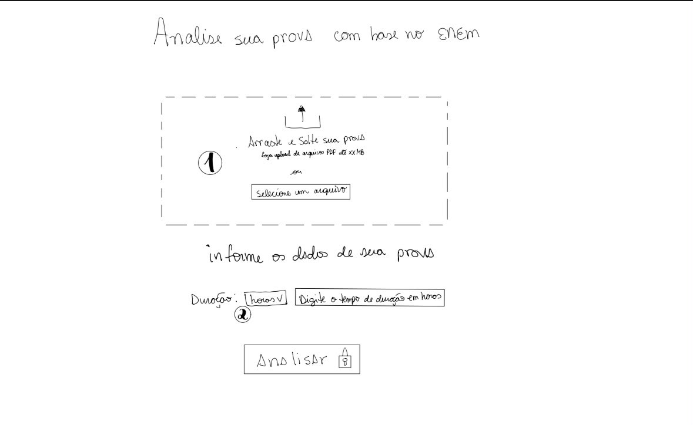
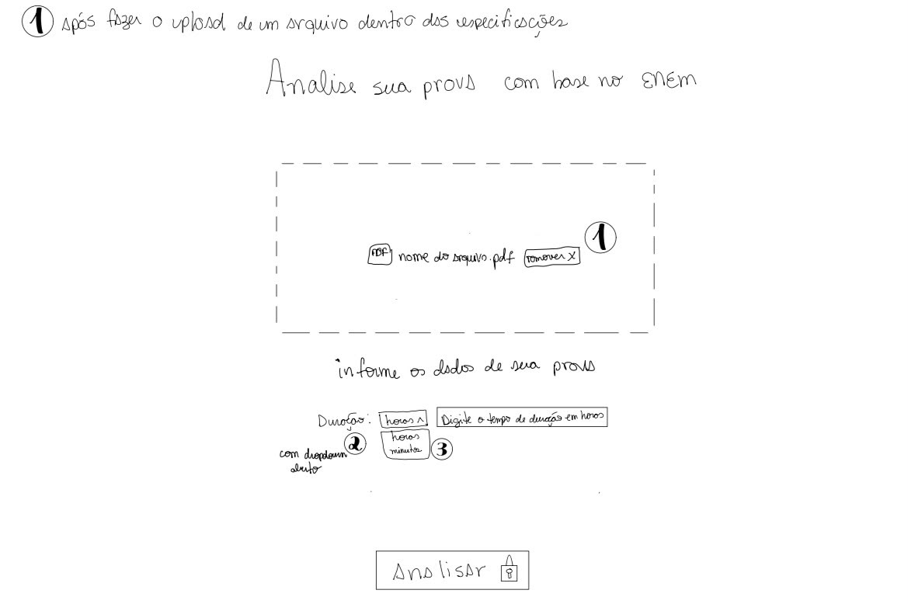
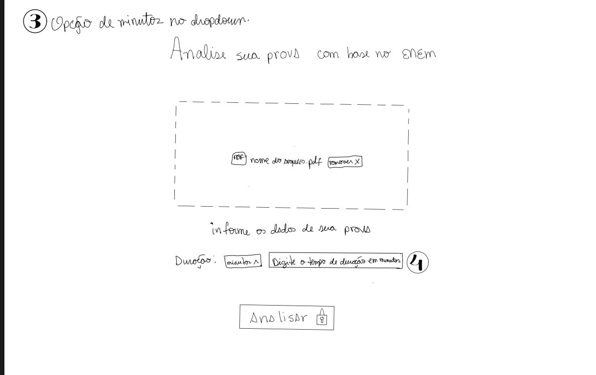
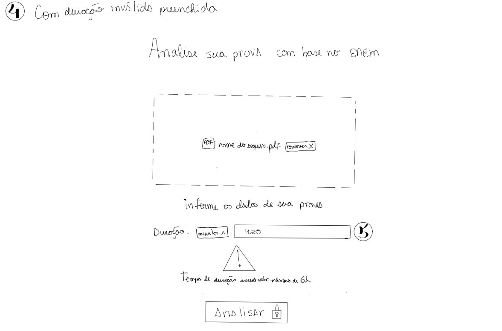
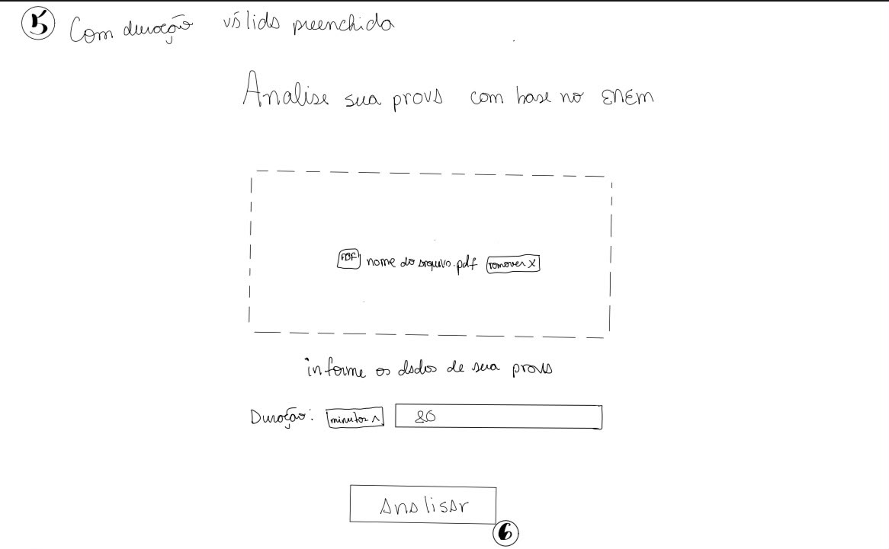
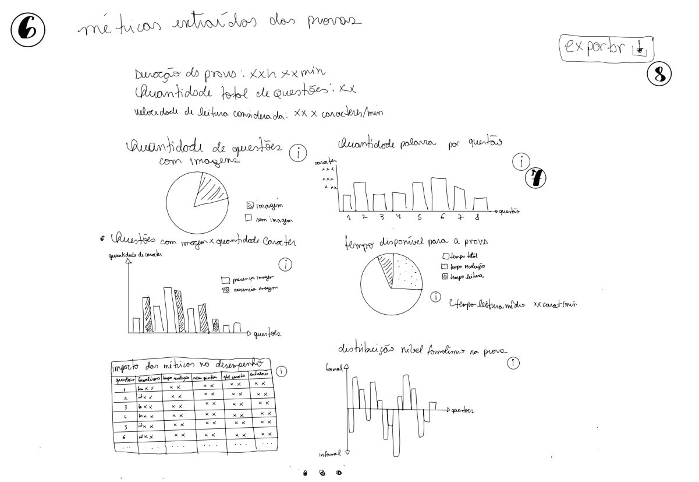
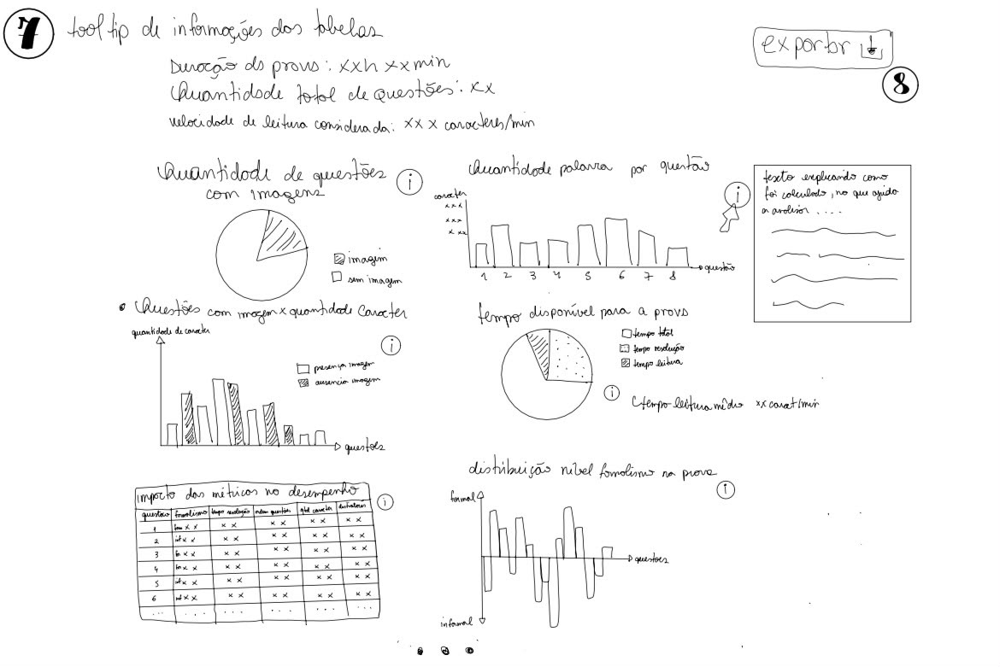
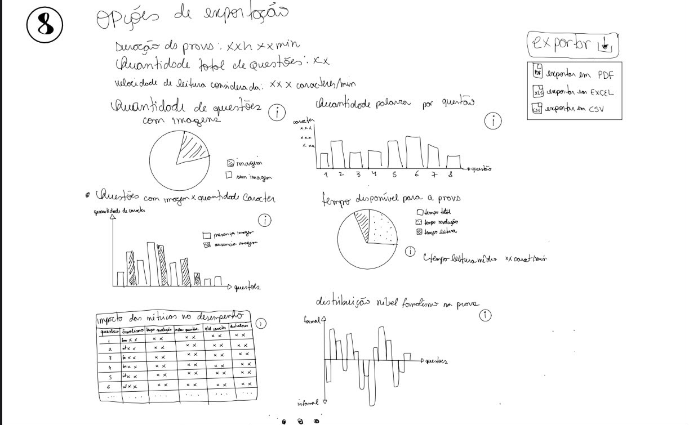

# Entrega 6 — Prototipação em papel

**Data:** 21/09/2026
**Status:** 🟨 Em andamento  
**Responsabilidade:** 1 solução integrada por equipe

## Objetivo da atividade

Externalizar rapidamente ideias de interação em baixa fidelidade para explorar alternativas antes de investir em detalhes visuais. O valor da atividade está no **ciclo construir → simular → observar → revisar**, não na beleza do desenho.

## 1. Escopo do protótipo

**Personas:** P01, P02, P03
**Cenários/tarefas cobertos:** C02/T01  
**Objetivos principais:** Analisar a prova antes de aplicá-la <!-- ?????? -->

## 1.1 Possíveis famílias de interface

Escolha apenas o que for coerente com tarefas e cenários. Para TCCs técnicos, o protótipo pode explorar:

- **dashboard** para monitoramento e tomada de decisão; ✅
- **configuração/parametrização** para preparar algoritmo/modelo/processo;❌
- **entrada/seleção de dados** com validação; ✅ ?????
- **acompanhamento de execução** com progresso, fila, cancelamento e recuperação;❌
- **relatório/resultados** com explicação, gráficos e exportação; ✅ ?????
- **histórico** com busca, filtros, ordenação e detalhes; ❌
- **comparação** entre execuções, versões, algoritmos ou períodos;❌
- **administração** de usuários, papéis, permissões ou entidades do domínio;❌
- **auditoria/logs** traduzidos para o perfil;❌
- **alertas/ocorrências** com ação de resposta.❌
<!-- adiciona detalhamento??
- **detalhamento** das métricas. -->

> Não desenhe todas essas telas por obrigação. O objetivo da baixa fidelidade é experimentar a **estrutura da interação** necessária para as tarefas priorizadas.

## 2. Fluxos escolhidos

| Fluxo | Tarefa/objetivo | Por que foi priorizado |
|---|---|---|
| PF01 | Analisar se características específicas da prova impactariam o desempenho dos alunos | Este é o principal objetivo do MVP do TCC. A solução busca avaliar se determinadas características estruturais identificadas no ENEM, como quantidade de palavras, presença de imagens, tempo estimado de resolução, nível de formalidade da linguagem, ordem das questões e qualidade dos distratores, podem influenciar o desempenho dos estudantes em outras avaliações enviadas pelos docentes. |

<!--ta certo isso?? ou seria fala os fluxos das telas que coloquei no assets?? -->

## 3. Telas e estados

- Numere as telas/estados (`P01`, `P02`, `P03`, `P04`, `P05`, `P06`,`P07`,`P08`.
- Indique controles que mudam o estado: 
    P01 Upload: Área de drag-and-drop/ botão "Anexar arquivo"  
    P02 Remover upload: Botão remover arquivo  
    P03 Dados da prova informados pelo docente: dropdown de hora/minuto [Protótipo tela com dropdown aberto](../assets/06_prototipos/prototipo_fluxo_02.jpeg) 
    P04 Duração: Input de duração em minutos [Protótipo tela com dropdown minutos selecionado](../assets/06_prototipos/prototipo_fluxo_03.jpeg) 
    P04 Warning: Warning ao digitar tempo superior a 6h (serve tanto para minutos quanto para horas) [Protótipo tela warning de tempo](../assets/06_prototipos/prototipo_fluxo_04.jpeg) 
    P05 Botão analisar habilitado: Ao preencher duração e anexar prova, botão de analisar é habilitado [Protótipo botão Analisar habilitado](../assets/06_prototipos/prototipo_fluxo_05.jpeg) 
    P06 Métricas: tela com métricas da prova extraídas [Protótipo métricas da prova](../assets/06_prototipos/prototipo_fluxo_06.jpeg) 
    P07 tooltip informações: ao lado de cada tabela tem um icone de (i) com informações sobre as respectivas tabelas [Protótipo tooltip informações](../assets/06_prototipos/prototipo_fluxo_07.jpeg) 
    P08 Exportação: Ao clicar no botão Exportar, mostra as opções de exportação [Protótipo tipos exportação](../assets/06_prototipos/prototipo_fluxo_08.jpeg) 

<!--- Mostre pelo menos caminhos principais e estados de erro/retorno relevantes.-->
## 4. Simulação / walkthrough

Realize uma simulação com uma pessoa que não participou da elaboração dessas telas. Um colega pode ser usado **para essa iteração formativa**, mas isso não substitui os participantes finais da Entrega 14.

| Observação | Tela/ação | Evidência | Consequência para o design |
|---|---|---|---|
| Nenhuma | Tela inicial (ações possíveis: anexar arquivo(arrastando ou pelo "selecione um arquivo"), digitar tempo em horas, expandir dropdown), ação realizada: anexar arquivo(arrastando ou pelo "selecione um arquivo")|  | Nenhuma |
| Nenhuma | Tela com upload feito (ações possíveis: remover arquivo, digitar tempo em horas, trocar dropdown de horas para "minutos"), ação realizada: trocar dropdown de horas para "minutos"|  | Nenhuma |
| Nenhuma | Tela digitar duração em minutoa (ações possíveis: remover arquivo, digitar tempo em minutos, expandir dropdown), ação realizada: digitar tempo em minutos |  | Nenhuma |
| Nenhuma | Tela de warning (serve tanto para minutos quanto para horas) (ações possíveis: remover arquivo, alterar tempo em minutos, trocar dropdown de horas para "horas"), ação realizada: alterar tempo em minutos|  | Nenhuma |
| Nenhuma | Habilitaão do botão de análise (ações possíveis: remover arquivo, alterar tempo em minutos, trocar dropdown de horas para "horas", clicar no botão "Analisar"), ação realizada: clicar no botão "Analisar"|  | Nenhuma |
| Nenhuma | Visualização das métricas extraídas da prova (ações possíveis: clicar em algum icone de informação (i), clicar no botão de "Exportar"), ação realizada: clicar em algum icone de informação (i) |  | Nenhuma |
| Nenhuma | Visualização do detalhamento de uma métrica (ações possíveis: voltar ao estado de visualização das métricas, clicar no botão de "Exportar"), ação realizada: clicar no botão de "Exportar" |  | Nenhuma |
| Nenhuma | Opção de exportação das métricas (ações possíveis: exportar como PDF, exportar como Excel, exportar como CSV |  | Nenhuma |

## 5. Alterações após a simulação

| Antes | Problema | Depois | Justificativa |
|---|---|---|---|
|  | Nenhuma | Manteve como antes | Nenhuma observação de melhoria |
|  | Nenhuma | Manteve como antes | Nenhuma observação de melhoria |
|  | Nenhuma | Manteve como antes | Nenhuma observação de melhoria |
|  | Nenhuma | Manteve como antes | Nenhuma observação de melhoria |
|  | Nenhuma | Manteve como antes | Nenhuma observação de melhoria |
|  | Nenhuma | Manteve como antes | Nenhuma observação de melhoria |
|  | Nenhuma | Manteve como antes | Nenhuma observação de melhoria |
|  | Nenhuma | Manteve como antes | Nenhuma observação de melhoria |

## Checklist

- [X] O protótipo cobre tarefas relevantes da Entrega 5.
- [X] Cada tela/estado pode ser justificado por uma tarefa, decisão ou informação necessária.
- [X] O projeto não criou dashboard/CRUD/login apenas para parecer “completo”.
- [X] Telas/estados estão numerados e navegáveis na documentação.
- [X] Há pelo menos uma simulação/walkthrough documentado.
- [X] Críticas não foram apenas listadas: geraram decisão de revisão.
- [X] O protótipo continua em baixa fidelidade; detalhes visuais não mascaram problemas de fluxo.
